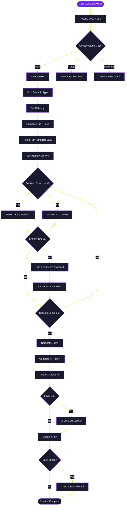

<div align="center">


<br>

<p>


</p>

<p>


</p>

<h3>🎮 Train Your Trading Skills in a Gamified Arena</h3>
<p><i>Replay real markets · Survive entropy shocks · Earn XP · Level up your instincts</i></p>

<p>
<a href="#-quick-start"></a>
<a href="#-how-to-play"></a>
<a href="#-tech-stack"></a>
</p>

</div>

---

## 📑 Table of Contents

| # | Section | Description |
|---|---------|-------------|
| 1 | [What is Oracle Gym?](#-what-is-oracle-gym) | Overview and core concept |
| 2 | [Architecture](#-architecture) | System flow and components |
| 3 | [Features](#-features) | Complete feature breakdown |
| 4 | [Quick Start](#-quick-start) | Installation and setup |
| 5 | [How to Play](#-how-to-play) | Gameplay guide |
| 6 | [Supported Assets](#-supported-assets) | All 13 crypto assets |
| 7 | [API Endpoints](#-api-endpoints) | Backend API reference |
| 8 | [Tech Stack](#-tech-stack) | Technologies used |
| 9 | [Deployment](#-deployment) | Deploy to production |
| 10 | [Contributing](#-contributing) | How to contribute |

---

## 🤖 What is Oracle Gym?

<div align="center">

### Oracle Gym is a **gamified crypto trading training platform** where you replay real markets and level up your skills.

#### It doesn't simulate. It replays actual Pyth price feeds.

<br>

<table width="85%">
<tr>
<td align="center" width="50%">


```diff
- Fake prices with no real market context
- No consequences for bad decisions
- Boring, repetitive practice
- No progression or rewards
```

</td>
<td align="center" width="50%">


```diff
+ Real Pyth price feeds from 13 assets
+ Entropy V2 random shock events
+ XP, levels, streaks, and rewards
+ AI-powered coaching and scoring
```

</td>
</tr>
</table>

</div>

<br>

### Core Principle

> **"Train like it's real. Learn from actual market conditions. Level up with every session."**

Oracle Gym uses live Pyth Network data to create realistic training scenarios. Every candle, every price tick, every volatility spike comes from real market history. Add Pyth Entropy V2 for unpredictable shock events, and you get a training ground that feels like the real thing.

<br>

### What Makes It Different

| Feature | Oracle Gym | Traditional Platforms |
|---------|-----------|----------------------|
| **Data Source** | Real Pyth price feeds | Simulated/fake data |
| **Randomness** | Pyth Entropy V2 (on-chain) | Pseudo-random |
| **Progression** | XP, levels, streaks | None |
| **Feedback** | AI coaching reports | Basic P&L |
| **Assets** | 13 major cryptos | Limited selection |
| **Cost** | Free (testnet) | Often paid |

---

## 🏗️ Architecture

<div align="center">

### Game Flow — From Connection to Completion

<sub>Built with Next.js 15 · Powered by Pyth Network · Deployed on Base Sepolia</sub>

<br>



</div>

---

## ✨ Features

<div align="center">

### Every Drill is a Battle

</div>

<table width="100%">
<tr>
<td width="50%" valign="top">

### 🎯 Core Gameplay


Replay actual Pyth price feeds from 13+ crypto assets. Every candle is real market data.


Make critical trading decisions at key market moments. Buy, sell, hold, reduce, wait, or hedge.


Survive random market disruptions powered by Pyth Entropy V2 on-chain randomness.


Get personalized feedback and scoring after each session with detailed performance analysis.

</td>
<td width="50%" valign="top">

### 🏆 Gamification System


Earn experience points and level up. 500 XP per level with unlimited progression.


Claim rewards for 7 consecutive days with multipliers from ×2 to ×14.


Earn and spend coins on game sessions and streak boosts. Start with 1,000 coins.


Compete with other traders on the rankings. Track your progress and climb the ladder.

</td>
</tr>
</table>

<br>

<details>
<summary><b>📊 Live Market Data (Click to expand)</b></summary>

<br>

| Feature | Details |
|---------|---------|
| **Assets** | 13 major cryptocurrencies (BTC, ETH, SOL, BNB, XRP, ADA, DOGE, AVAX, POL, LINK, UNI, ATOM, PYTH) |
| **Real-time Prices** | Live ticker with 30-second updates via Pyth Hermes API |
| **Pyth Pro Integration** | Enhanced rate limits (1,000+ req/min) with Pro API token |
| **Official Icons** | Crypto logos from CoinGecko CDN for professional UI |
| **Data Fields** | Price, expo, publish_time, conf (confidence interval) |
| **Update Frequency** | 30s for live ticker, 15min candles for replay |

</details>

<details>
<summary><b>🎲 Pyth Entropy V2 Integration (Click to expand)</b></summary>

<br>

| Component | Implementation |
|-----------|----------------|
| **Verifiable Randomness** | Boss fight shock events using on-chain entropy |
| **Smart Contract** | Deployed consumer contract on Base Sepolia |
| **Contract Address** | `0x148123bc5b719a7e169ee652a72be387c964b6f4` |
| **Execution Tracking** | Monitor gas usage and callback status |
| **Explorer Integration** | View entropy requests on Pyth Explorer |
| **Callback Gas Limit** | 180,000 gas for reliable execution |

</details>

<details>
<summary><b>🎮 Scenario Types (Click to expand)</b></summary>

<br>

| Scenario | Pacing | Description |
|----------|--------|-------------|
| **Breakout** | Momentum | Trend compression snaps into expansion. Enter conviction without chasing noise. |
| **Crash** | Defensive | Violent downside unwind punishes hesitation and overconfidence. |
| **Chop** | Patience | Whipsaw price action punishes overtrading and rewards restraint. |
| **Fakeout** | Trap-heavy | Momentum looks clean until the floor disappears. Read the trap first. |
| **Slow Bleed** | Grinding | Long, draining descent tests discipline more than reflexes. |
| **Volatility Spike** | Chaos | Wide candles and sharp reversals make risk framing critical. |

</details>

<details>
<summary><b>⚡ Difficulty Levels (Click to expand)</b></summary>

<br>

| Level | Description | Characteristics |
|-------|-------------|-----------------|
| **Easy** | Cleaner structure and visible setups | Clear patterns, predictable movements |
| **Medium** | Balanced uncertainty and one meaningful shock | Mixed signals, moderate complexity |
| **Chaos** | Hidden shock, faster tape, thinner confidence | Unpredictable, high-speed decisions |

</details>

---

## 🚀 Quick Start

### Prerequisites

```bash
✅ Node.js 18+ and npm
✅ MetaMask or compatible Web3 wallet
✅ Base Sepolia testnet ETH (for entropy features)
```

### Installation

```bash
# Clone the repository
git clone https://github.com/koushiknoah77/orcale-gym.git
cd pyth-oracle-gym

# Install dependencies
npm install

# Copy environment variables
cp .env.example .env.local

# Start development server
npm run dev
```

Open [http://localhost:3000](http://localhost:3000) in your browser.

### Environment Configuration

Create a `.env.local` file with the following:

```bash
# Pyth Network APIs
PYTH_HISTORY_BASE_URL=https://history.pyth-lazer.dourolabs.app/v1
PYTH_HERMES_BASE_URL=https://hermes.pyth.network
PYTH_PRO_ACCESS_TOKEN=your_pyth_pro_token_here

# Pyth Entropy V2 (Base Sepolia)
ENTROPY_RPC_URL=https://sepolia.base.org
ENTROPY_CONSUMER_ADDRESS=0x148123bc5b719a7e169ee652a72be387c964b6f4
ENTROPY_REQUESTER_PRIVATE_KEY=your_private_key_here
ENTROPY_CHAIN_ID=84532
ENTROPY_CALLBACK_GAS_LIMIT=180000

# Optional
ORACLE_GYM_STORE_PATH=.data/oracle-gym-store.json
NEXT_PUBLIC_GYM_SEASON_ID=season-1
```

<details>
<summary><b>🔑 Getting API Keys (Click to expand)</b></summary>

<br>

1. **Pyth Pro Token**: Sign up at [pyth.network](https://pyth.network) for enhanced rate limits (1,000+ req/min)
2. **Entropy Setup**: Deploy the included smart contract or use the provided testnet address
3. **Base Sepolia ETH**: Get testnet ETH from [Base Sepolia Faucet](https://www.coinbase.com/faucets/base-ethereum-goerli-faucet)

</details>

---

## 🎮 How to Play

<div align="center">

### Three Rounds to Victory

<sub>Connect · Train · Dominate</sub>

</div>

<br>

<table width="100%">
<tr>
<td width="33%" align="center" valign="top">

### 🔗 Round 1
### Connect Wallet


<br>

1. Click **"Connect"** in top nav
2. Choose your wallet (300+ supported)
3. Switch to **Base Sepolia** network
4. Receive **1,000 coins** on first connection

<br>


</td>
<td width="33%" align="center" valign="top">

### ⚔️ Round 2
### Enter Arena


<br>

1. Click **"ENTER ARENA"** or **"Train"** tab
2. Select asset (BTC, ETH, SOL, etc.)
3. Choose scenario type (breakout, crash, etc.)
4. Pick difficulty and risk rules
5. Start replay session

<br>


</td>
<td width="33%" align="center" valign="top">

### 🏆 Round 3
### Claim Victory


<br>

1. Make decisions at checkpoints
2. Survive entropy shock event
3. Complete session
4. Review AI coaching report
5. Earn **XP, coins, and level up**

<br>


</td>
</tr>
</table>

<br>

### 🎯 Decision Actions

At each checkpoint, choose your action:

| Action | Icon | Description | When to Use |
|--------|------|-------------|-------------|
| **Buy** | 🟢 | Enter long position | Bullish setup, strong momentum |
| **Sell** | 🔴 | Exit or short | Bearish signal, risk off |
| **Hold** | ⏸️ | Maintain position | Trend continuation, no clear signal |
| **Reduce** | 📉 | Decrease exposure | Take profits, manage risk |
| **Wait** | ⏳ | Skip checkpoint | Unclear setup, patience |
| **Hedge** | 🛡️ | Protect position | High uncertainty, defensive |

<br>

### 🔥 Daily Streak System

<div align="center">


</div>

Claim rewards for consecutive days. Must claim in sequential order.

| Day | Reward | Multiplier | Total Potential |
|-----|--------|------------|-----------------|
| Day 1 | 100 coins | ×2 | 200 coins |
| Day 2 | 150 coins | ×4 | 600 coins |
| Day 3 | 200 coins | ×6 | 1,200 coins |
| Day 4 | 250 coins | ×8 | 2,000 coins |
| Day 5 | 300 coins | ×10 | 3,000 coins |
| Day 6 | 350 coins | ×12 | 4,200 coins |
| Day 7 | 500 coins | ×14 | 7,000 coins |

After Day 7, streak resets to 0 for next cycle. Multipliers apply to session earnings.

---

## 📊 Supported Assets

<div align="center">

### 13 Major Cryptocurrencies with Real Pyth Price Feeds

</div>

<br>

<table width="100%">
<tr>
<td width="25%" align="center">


**Bitcoin / USD**

Base: $72,250

</td>
<td width="25%" align="center">


**Ethereum / USD**

Base: $3,975

</td>
<td width="25%" align="center">


**Solana / USD**

Base: $176

</td>
<td width="25%" align="center">


**BNB / USD**

Base: $635

</td>
</tr>
<tr>
<td width="25%" align="center">


**Ripple / USD**

Base: $2.45

</td>
<td width="25%" align="center">


**Cardano / USD**

Base: $0.98

</td>
<td width="25%" align="center">


**Dogecoin / USD**

Base: $0.32

</td>
<td width="25%" align="center">


**Avalanche / USD**

Base: $42

</td>
</tr>
<tr>
<td width="25%" align="center">


**Polygon / USD**

Base: $0.52

</td>
<td width="25%" align="center">


**Chainlink / USD**

Base: $22

</td>
<td width="25%" align="center">


**Uniswap / USD**

Base: $13

</td>
<td width="25%" align="center">


**Cosmos / USD**

Base: $9.5

</td>
</tr>
<tr>
<td width="25%" align="center" colspan="4">


**Pyth Network / USD**

Base: $0.71

</td>
</tr>
</table>

<details>
<summary><b>📋 Complete Asset Details (Click to expand)</b></summary>

<br>

| Symbol | Name | Pyth Feed ID | Exponent |
|--------|------|--------------|----------|
| BTC | Bitcoin | `e62df6c8b4a85fe1a67db44dc12de5db330f7ac66b72dc658afedf0f4a415b43` | -8 |
| ETH | Ethereum | `ff61491a931112ddf1bd8147cd1b641375f79f5825126d665480874634fd0ace` | -8 |
| SOL | Solana | `ef0d8b6fda2ceba41da15d4095d1da392a0d2f8ed0c6c7bc0f4cfac8c280b56d` | -8 |
| BNB | BNB | `2f95862b045670cd22bee3114c39763a4a08beeb663b145d283c31d7d1101c4f` | -8 |
| XRP | Ripple | `ec5d399846a9209f3fe5881d70aae9268c94339ff9817e8d18ff19fa05eea1c8` | -8 |
| ADA | Cardano | `2a01deaec9e51a579277b34b122399984d0bbf57e2458a7e42fecd2829867a0d` | -8 |
| DOGE | Dogecoin | `dcef50dd0a4cd2dcc17e45df1676dcb336a11a61c69df7a0299b0150c672d25c` | -8 |
| AVAX | Avalanche | `93da3352f9f1d105fdfe4971cfa80e9dd777bfc5d0f683ebb6e1294b92137bb7` | -8 |
| POL | Polygon | `ffd11c5a1cfd42f80afb2df4d9f264c15f956d68153335374ec10722edd70472` | -8 |
| LINK | Chainlink | `8ac0c70fff57e9aefdf5edf44b51d62c2d433653cbb2cf5cc06bb115af04d221` | -8 |
| UNI | Uniswap | `78d185a741d07edb3412b09008b7c5cfb9bbbd7d568bf00ba737b456ba171501` | -8 |
| ATOM | Cosmos | `b00b60f88b03a6a625a8d1c048c3f66653edf217439983d037e7222c4e612819` | -8 |
| PYTH | Pyth Network | `0bbf28e9a841a1cc788f6a361b17ca072d0ea3098a1e5df1c3922d06719579ff` | -8 |

</details>

---

## 🔌 API Endpoints

<div align="center">

### RESTful API for Game State and Market Data

</div>

<br>

<table width="100%">
<tr>
<td width="50%" valign="top">

### 📡 Public APIs


List available crypto assets with Pyth feed IDs


Real-time price snapshots for all assets


System health check and API status


User XP, level, streak, balance


Session history with scores


Top scores and rankings

</td>
<td width="50%" valign="top">

### 🎮 Game Session APIs


Create new scenario configuration


Get scenario details by ID


Start new game session


Get session state and progress


Record trading decision


Request Pyth Entropy V2 shock


Finalize and calculate score


Get AI coaching report

</td>
</tr>
<tr>
<td width="50%" valign="top">

### 🔥 Streak System APIs


Claim daily streak reward


Get current coin balance


Mark wallet as seen (welcome bonus)

</td>
<td width="50%" valign="top">

### 🔍 Internal APIs


Fetch latest Pyth prices


Fetch historical Pyth data


Evaluate session performance


Generate AI coaching feedback

</td>
</tr>
</table>

---

## ⚡ Tech Stack

<div align="center">

### Built with Modern Web3 Technologies

</div>

<br>

<table width="100%">
<tr>
<td width="33%" align="center" valign="top">

### 🎨 Frontend


</td>
<td width="33%" align="center" valign="top">

### ⛓️ Blockchain


</td>
<td width="33%" align="center" valign="top">

### 🔮 Pyth Network


</td>
</tr>
</table>

<br>

<details>
<summary><b>📦 Complete Dependencies (Click to expand)</b></summary>

<br>

```json
{
  "dependencies": {
    "@radix-ui/react-dialog": "^1.1.15",
    "@radix-ui/react-progress": "^1.1.8",
    "@radix-ui/react-tabs": "^1.1.13",
    "@reown/appkit": "^1.8.19",
    "@reown/appkit-adapter-wagmi": "^1.8.19",
    "@tanstack/react-query": "^5.95.2",
    "ethers": "^6.15.0",
    "framer-motion": "^12.38.0",
    "lucide-react": "^1.6.0",
    "next": "16.2.1",
    "react": "19.2.4",
    "react-confetti": "^6.4.0",
    "react-dom": "19.2.4",
    "recharts": "^3.8.1",
    "viem": "^2.47.6",
    "wagmi": "^3.6.0"
  }
}
```

</details>

---

## 📁 Project Structure

```
pyth-oracle-gym/
├── src/
│   ├── app/                          # Next.js App Router
│   │   ├── api/                     # API routes
│   │   │   ├── balance/            # Coin balance
│   │   │   ├── history/            # Session history
│   │   │   ├── leaderboard/        # Rankings
│   │   │   ├── live/               # Real-time prices
│   │   │   ├── scenarios/          # Scenario management
│   │   │   ├── sessions/           # Game sessions
│   │   │   ├── streak-claim/       # Streak rewards
│   │   │   ├── symbols/            # Asset list
│   │   │   └── user-stats/         # User stats
│   │   ├── gym/                    # Training mode page
│   │   ├── history/                # Session history page
│   │   ├── replay/[sessionId]/     # Replay viewer
│   │   ├── report/[sessionId]/     # Session report
│   │   ├── settings/               # Settings page
│   │   ├── layout.tsx              # Root layout
│   │   ├── page.tsx                # Home page
│   │   └── globals.css             # Global styles
│   ├── components/                  # React components
│   │   ├── candlestick-chart.tsx   # Price chart
│   │   ├── live-market-strip.tsx   # Market ticker
│   │   ├── live-ticker-bar.tsx     # Top ticker
│   │   ├── oracle-nav.tsx          # Navigation bar
│   │   ├── orderbook.tsx           # Order book display
│   │   ├── replay-lab.tsx          # Replay interface
│   │   ├── report-view.tsx         # Session report
│   │   ├── reward-popup.tsx        # Reward notifications
│   │   ├── scenario-studio.tsx     # Scenario builder
│   │   ├── streak-shop.tsx         # Streak calendar
│   │   ├── wallet-connect-provider.tsx  # Wallet provider
│   │   ├── wallet-gate.tsx         # Wallet gate
│   │   ├── wallet-selector-modal.tsx    # Wallet selector
│   │   └── welcome-modal.tsx       # Welcome screen
│   ├── lib/                         # Core logic
│   │   ├── constants.ts            # Asset definitions
│   │   ├── entropy.ts              # Entropy V2 integration
│   │   ├── oracle-engine.ts        # Scoring & AI coaching
│   │   ├── oracle-store.ts         # Game state management
│   │   ├── ownership.ts            # User ownership
│   │   ├── pyth.ts                 # Pyth API integration
│   │   ├── types.ts                # TypeScript types
│   │   └── wagmi-config.ts         # Wagmi configuration
│   └── contracts/                   # Smart contracts
│       └── OracleGymEntropyConsumer.sol
├── public/                          # Static assets
├── .data/                           # Local storage (gitignored)
├── .env.local                       # Environment variables
├── .gitignore                       # Git ignore rules
├── GAMIFICATION_SYSTEM.md           # Game mechanics docs
├── HACKATHON_SUBMISSION.md          # Submission template
├── LICENSE                          # Apache 2.0 license
├── next.config.ts                   # Next.js config
├── package.json                     # Dependencies
├── README.md                        # This file
└── tsconfig.json                    # TypeScript config
```

---

## 🚢 Deployment

<div align="center">

### Deploy to Production in Minutes

</div>

<br>

<table width="100%">
<tr>
<td width="33%" align="center" valign="top">

### 

```bash
# Push to GitHub
git push origin main

# Import in Vercel
# Add environment variables
# Deploy!
```

Or use Vercel CLI:

```bash
npm install -g vercel
vercel
```

</td>
<td width="33%" align="center" valign="top">

### 

```bash
# Build command
npm run build

# Publish directory
.next
```

Add environment variables in Netlify dashboard.

</td>
<td width="33%" align="center" valign="top">

### 

```bash
# Build for production
npm run build

# Start server
npm start

# Or use PM2
pm2 start npm --name "oracle-gym" -- start
```

</td>
</tr>
</table>

---

## 🎯 Hackathon Submission

<div align="center">


### This project demonstrates comprehensive Pyth Network integration

</div>

<br>

| Category | Implementation | Status |
|----------|----------------|--------|
| **Pyth Price Feeds** | Real-time and historical price data for 13 assets | ✅ Complete |
| **Pyth Entropy V2** | Verifiable on-chain randomness with deployed contract | ✅ Complete |
| **Pyth Pro API** | Enhanced rate limits (1,000+ req/min) | ✅ Complete |
| **Smart Contract** | Custom entropy consumer on Base Sepolia | ✅ Deployed |
| **Gamification** | XP, levels, streaks, rewards system | ✅ Complete |
| **Production Ready** | Deployable, scalable, documented | ✅ Complete |

<br>

<details>
<summary><b>📋 Submission Checklist (Click to expand)</b></summary>

<br>

- [x] Real Pyth price feeds integration
- [x] Pyth Entropy V2 smart contract deployed
- [x] 13 supported crypto assets
- [x] 6 scenario types with 3 difficulty levels
- [x] Custom scoring algorithm
- [x] 7-day streak system with multipliers
- [x] Wagmi v3 wallet support (300+ wallets)
- [x] Complete documentation
- [x] Production-ready deployment
- [x] Open source (Apache 2.0)

</details>

---

## 🤝 Contributing

Contributions are welcome! Here's how you can help:

1. **Fork the repository**
2. **Create a feature branch** (`git checkout -b feature/amazing-feature`)
3. **Commit your changes** (`git commit -m 'Add amazing feature'`)
4. **Push to the branch** (`git push origin feature/amazing-feature`)
5. **Open a Pull Request**

<br>

<div align="center">


</div>

---

## 📄 License

<div align="center">

This project is licensed under the **Apache License 2.0**

See the [LICENSE](LICENSE) file for details.

<br>


</div>

---

## 📞 Support & Resources

<table width="100%">
<tr>
<td width="50%" align="center">

### 📚 Documentation

- [GAMIFICATION_SYSTEM.md](GAMIFICATION_SYSTEM.md) - Game mechanics
- [HACKATHON_SUBMISSION.md](HACKATHON_SUBMISSION.md) - Submission details
- [Pyth Network Docs](https://docs.pyth.network) - Official docs

</td>
<td width="50%" align="center">

### 🔗 Links

- [GitHub Repository](https://github.com/koushiknoah77/orcale-gym)
- [Pyth Network](https://pyth.network)
- [Base Sepolia Faucet](https://www.coinbase.com/faucets/base-ethereum-goerli-faucet)

</td>
</tr>
</table>

---

## 🙏 Acknowledgments

<div align="center">

Special thanks to the teams and projects that made this possible:

<br>

<table width="80%">
<tr>
<td width="25%" align="center">


Real-time oracle data and entropy

</td>
<td width="25%" align="center">


Sepolia testnet infrastructure

</td>
<td width="25%" align="center">


Amazing React framework

</td>
<td width="25%" align="center">


Crypto asset icons

</td>
</tr>
</table>

</div>

---

<div align="center">


<br>

**Built with ❤️ for the Pyth Community Hackathon**

<br>


<br>

<sub>© 2026 Oracle Gym · Licensed under Apache 2.0 · Powered by Pyth Network</sub>

<br>

**[⬆ Back to Top](#)**

</div>
